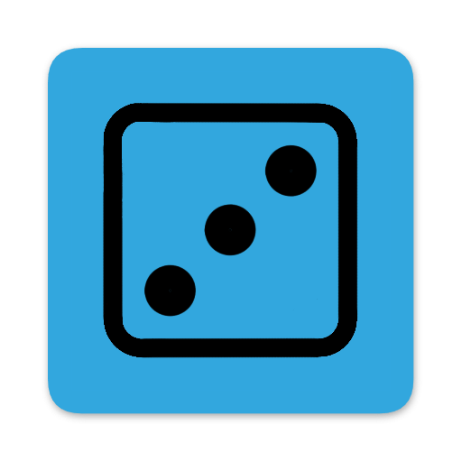
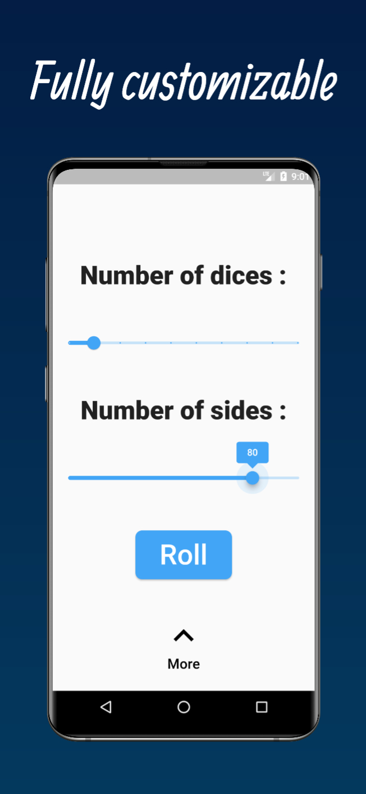
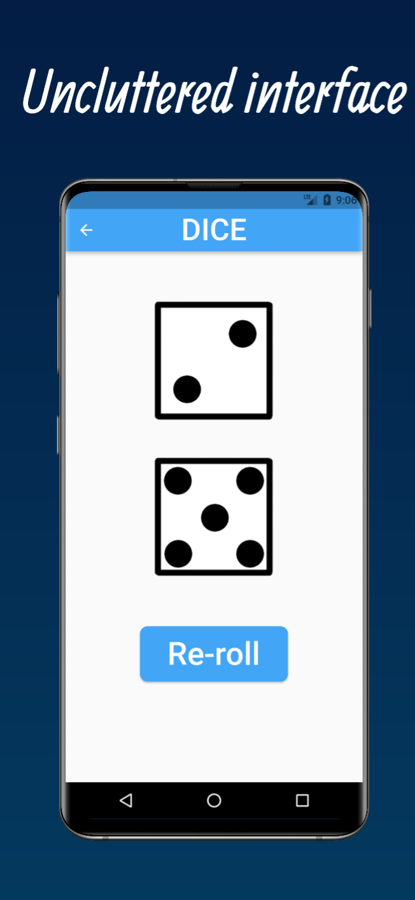
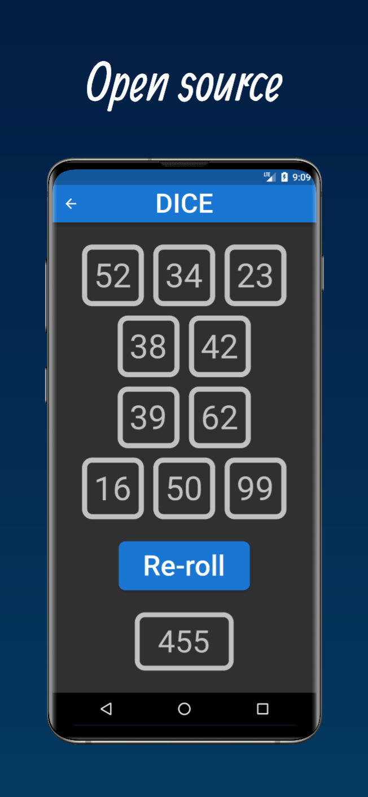

  

<h1 align="center">Dice app</h1>

  

    A simple dice app build with flutter. Design for mobile (Android an iOS).
     
    <a href="https://github.com/Mat029/Dice/issues">Report Bug</a>
    ·
    <a href="https://github.com/Mat029/Dice/issues">Request Feature</a>
  

  <table border="3" align="center">
  <tr>
    <th></img></th>
    <th></img></th>
  </tr>
  <tr>
    <td></img></td>
    <td></img></td>
  </tr>
  </table>

## Project

* This is my first app and I used it to learn flutter. 
* If you have ideas to improve the app, look in [Contribution](CONTRIBUTING.md)
* Requirement : flutter >= 3.0.0

## Features :

* Roll dice (1 to 6 dice, 1 to 100 sides)
* Dark theme
* Total counter
* Some infos / customization options
* See [Patch notes](CHANGES.md) for more information on the features we have added.

## Future features

* See the roadmap : [Road map](ROAD_MAP.md)
* Give your suggestions ([Contribution](CONTRIBUTING.md)) !!!

## Money 

* Free
* No ads
* No paid options
* We do not collect data : [Privacy policy](https://github.com/Mat029/mat029studio_privacy/blob/main/privacy_policy_dice.md)
* (This is just a learning project, I'm not looking to make money)

## Available :
### Android (Android 4.4 or higer) 

* Official version [See release](https://github.com/Mat029/Dice/releases) (apk)
* Build it yourself with the sources

### iOS (iOS 9 or higer)

* iOS policy prevents distribution of the app outside the store 
* At the moment, I don't have an Apple developer account so I cant publish to iOS

## Languages

* English
* French 
* German
* Spanish
* (Other soon avalaible, see [Contribution](CONTRIBUTING.md) if you want to add or correct a language)

## Info and contact

* Send a mail to mat029studiocontact@gmail.com (preferably in english or french)
* See [Contribution](CONTRIBUTING.md) if you want to report a bug
* License : [MIT](LICENSE)

### Credits

* Thanks to previewed app for store mockucp, I use this template as a base : https://previewed.app/template/6942AF31
* Thanks to all package creators !!! 
* Google Play and the Google Play logo are trademarks of Google LLC.